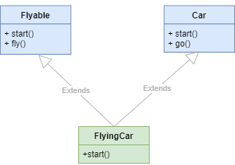

# Object Oriented Programming OOP
## Section 1 Classes and Objects

```python
class Person:

    counter = 0
    
    def __init__(self, name, age):
        self.name = name
        self.age = age
        Person.counter += 1

    def greet(slef):
        return f"Hi, it's {self.name}"

p1 = Person('John', 23)
p2 = Person('Alex', 34)

print(Person.counter)
```

Everything in Python is an object including class. In other words a class is an object in Python\
When you define a class using the `class` keyword Python creates an object with the name the same as the class's name\

```python
class HtmlDocument:
    extension = 'html'
    version = 5

# Get attribute of class
extension = getattr(HtmlDocument.extension)
version = getattr(HtmlDocument.version)

# Set attribute of class
setattr(HtmlDocument, 'version', 10)
HtmlDocument.media_type = 'text/html'
```

### __init__

```python
class Person:
    def __init__(self, name, age):
        self.name = name
        self.age = age

if __name__ == '__main__':
    person = Person('John', 25)
    print(f"I'm {person.name}. I'm {person.age} years old.")
```


### Introduction to Encapsulation in Python
Excapsulation is one of the four fundamental concepts in OOP
including
- Absraction
- Encapsulation
- Inheritance
- Polymorphism

**Encapsulation** is the packing of data and functions that work on that data with in
a single object. By doing this you can hide the intertal state of the object from the
outside. This is known as information hiding\

A Class in Python has three type of access modifiers
- **Public Access Modifier** Theoretically public methods and fields can be accessed direcly by any class
- **Protected Access Modifier** Theoretically protected methods and fields can be accessed within the same
class it is declared and its subclass.
- **Private Access Modifier** Theoretically private methods and fields can be only accessed within the same 
class it is declared\
Mentioning Theoretically because python doesn't follow the textbook definition of such specifications.


```python

    # public data members
    ...
    def __init__(self, name, age):
        self.age = age
        self.name = name
    ...
    # protected data members
    ...
    def __init__(self, name, age):
        self._name = name
        self._age = age
    ...
    # private data members
    ...
    def __init__(self, name, age):
        self.__name = name
        self.__age = age
    ...
```

### Static methods
In proactice you use static methods to define utility methods or group functions that have some logical relationship in a class\


```python
class TemperatureConverter:
    KEVIN = 'K',
    FAHRENHEIT = 'F'
    CELSIUS = 'C'

    @staticmethod
    def fahrenheit_to_kelvin(f):
        return 5*(f+459.67)/9

    @staticmethod
    def kelvin_to_fahrenheit(k):
        return 9*k/5 - 459.67

    @staticmethod
    def format(value, unit):
        symbol = ''
        if unit == TemperatureConverter.FAHRENHEIT:
            symbol = '°F'
        elif unit == TemperatureConverter.CELSIUS:
            symbol = '°C'
        elif unit == TemperatureConverter.KEVIN:
            symbol = '°K'

        return f'{value}{symbol}'

```

### Class methods

```python
class Geeks:
    course = 'DSA'
    count = 0

    def __init__(self, name):
        self.name = name
        Geeks.count += 1

    @classmethod
    def get_course(cls):
        return f"Course: {cls.course}"

    @classmethod
    def get_instance_count(cls):
        return f"Number of instances: {len(cls.list_of_instances)}"

    @staticmethod
    def welcome_message():
        return "Welcome to Geeks for Geeks!"

```

## Section 2. Special Methods

### __hash__
```python

class Point:
    def __init__(self, x, y):
        self.x = x
        self.y = y
    
    def __eq__(self, other):
        if not isinstance(other, Point):
            return NotImplemented
        return self.x == other.x and self.y == other.y
    

    def __hash__(self):
        return hash((self.x, self.y))

p1 = Point(3, 4)
p2 = Point(3, 4)
p3 = Point(1, 2)

point_set {p1, p2, p3}

print(point_set)

```

## Section 3. Property

```python
class Person:
    def __init__(self, name, age):
        self.name = name
        self._age = age

    @property
    def age(self):
        return self._age

    @age.setter
    def set_age(self, value):
        if value <= 0:
            raise ValueError('The age must be positive')
        self._age = value
    
    @name.deleter
    def name(self):
        del self._name
```

## Section 4. Single Inheritance


```python
class Employee:
    def __init__(self, name, base_pay, bonus):
        self.name = name
        self.base_pay = base_pay
        self.bonus = bonus

    def get_pay(self):
        return self.base_pay + self.bonus

class SalesEmployee(Employee):
    def __init__(self, name, base_pay, bonus, sales_incentive):
        super().__init__(name, base_pay, bonus)
        self.sales_incentive = sales_incentive

    def get_pay(self):
        return self.base_pay + self.bonus + self.sales_incentive
```

### Slots

```python
class Point2D:
    __slots__ = ('x', 'y')

    def __init__(self, x, y):
        self.x = x
        self.y = y

    def __repr__(self):
        return f'Point2D({self.x},{self.y})'
```


### Abstract Class
In object-oriented programming an abstract class is a class that cannot be instantiated. \
However you can create calsses that inherit from an abstract class. \
Typically you use ab abstract class to create a bluprint for other classes. \
Similalry an abstract method is an method without implementation. An abstract class 
may or may not include abstract methods. \

**Abstract methods** in Python are used to define methods that must be implemented by subclass of 
an abstract class. They server as a bluprint or contract for what methods a subclass must implemented.


```python
from abc import ABC, abstractmethod

class AbstractClassName(ABC):
    @absractmethod
    def abstract_method_name(self):
        pass
    
```

```python
from abc import ABC, mastractmethod

class Employee(ABC):
    def __init__(self, first_name, last_name):
        self.first_name = first_name
        self.last_name = last_name
    
    @property
    def full_name(self):
        return f"{self.first_name} {self.last_name}"
    
    @abstractemthod
    def get_salary(self):
        pass

class FullTimeEmployee(Employee):
    def __init__(self, firt_name, last_name, salary):
        super().__init__(first_name, last_name)
        self.salary = salary
    
    def get_salary(self):
        return self.salary
    
class HourlyEmployee(Employee):
    def __init__(self, first_name, last_name, worked_hours, rate):
        super().__init__(first_name, last_name)
        self.worked_hours = worked_hours
        self.rate = rate
    
    def get_salary(self):
        return self.worked_hours * self.rate

class Payroll:
    def __init__(self):
        self.employee_list = []
    
    def add(self, employee):
        self.employee_list.append(employee)
    
    def print(self):
        for employee in employee_list:
            print(f"{employee.full_name} \t ${e.get_salary()}")

payroll = Payroll()

payroll.add(FulltimeEmployee('John', 'Doe', 6000))
payroll.add(FulltimeEmployee('Jane', 'Doe', 6500))
payroll.add(HourlyEmployee('Jenifer', 'Smith', 200, 50))
payroll.add(HourlyEmployee('David', 'Wilson', 150, 100))
payroll.add(HourlyEmployee('Kevin', 'Miller', 100, 150))

payroll.print()

```


```bash
John Doe 	 $6000
Jane Doe 	 $6500
Jenifer Smith 	 $10000
David Wilson 	 $15000
Kevin Miller 	 $15000
```


## Section 6. Multiple Inheritence

### Method Resolution Order (MRO)
When the parent classes have methods with the same name and the child class calls the method, Python
uses the method resolution order (MRO) to search for the right method to call.\



```python
class Car:
    def start(self):
        print('Start the Car')

    def go(self):
        print('Going')


class Flyable:
    def start(self):
        print('Start the Flyable object')

    def fly(self):
        print('Flying')


class FlyingCar(Flyable, Car):
    def start(self):
        super().start()

```


### MRO and super()

```python
class A:
    def __init__(self):
        print("Initializing A")

class B:
    def __init__(self):
        print("Initializing B")

class C(A, B):
    def __init__(self):
        super().__init__()  # Calls the next class in MRO
        print("Initializing C")

# Creating an instance of C
c = C()
```

Output
```css
Initializing A
Initializing C
```

Here `super().__init__()` calss `A.__init__()` but `B.__init__()` is never called.
This is because `super()` follows the **MRO** (`C -> A -> B -> object`) and `A` does not call
`super().__init__()`

```python
class A:
    def __init__(self):
        super().__init__()
        print("Initializing A")

class B:
    def __init__(self):
        super().__init__()
        print("Initializing B")

class C(A, B):
    def __init__(self):
        super().__init__()
        print("Initializing C")

# Creating an instance of C
c = C()
```

Output
```css
Initializing B
Initializing A
Initializing C
```


### Mixins
A **mixin** is a class that provides method implementations for reuse by multiple
related child classes. However, the Inheritance isnot implying an is-a-relationship\
A mixin doesn't define a new type. Therefore it is not intended for direction instantiation\
A mixin bundles a set of methods for reuse. Each mixin should have a single specific behavior, implementing closely related methods.

Python Mixin Example
```python
class Person:
    def __init__(self, name):
        self.name = name

class Employee(Person):
    def__init__(self, name, skills, dependents):
        super().__init__(name)
        self.skills = skills
        self.dependents = dependents
    
```